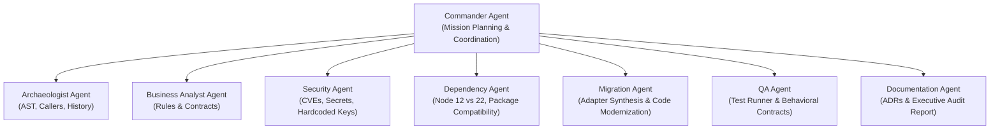

# ReForge — Multi-Agent Architecture

ReForge orchestrates a specialized team of 8 agent personas coordinated by a central **Commander**:

## Agent Personas & Responsibilities

| Agent Persona | Role & Responsibilities | Core Tooling / Engine |
| :--- | :--- | :--- |
| **Commander Agent** | Coordinates the 9-phase mission workflow, manages agent dependencies, triggers Human Approval Gates, and synthesizes console logs. | `MissionEngine`, `FastAPI` |
| **Archaeologist Agent** | Explores repository AST, maps file hierarchies, traces incoming callers, and grounds architectural answers in exact line numbers. | `RepoAnalyzer`, `AskWhyAgent` |
| **Business Analyst Agent** | Scans code for hidden business rules (discounts, validation thresholds, retries) and formulates Behavioral Contracts. | `BusinessRuleMiner` |
| **Security Agent** | Identifies deprecated dependencies (`request`), hardcoded fallback secrets (`JWT_SECRET`), and unverified token algorithms. | `RepoAnalyzer (Security)` |
| **Dependency Agent** | Evaluates `package.json`, maps migration paths from Node 12 to Node 22, and identifies breaking API changes. | `RepoAnalyzer (Dependencies)` |
| **Migration Agent** | Synthesizes modernization code in isolated workspaces, introduces the `PaymentAdapter` pattern, and preserves human-approved behaviors. | Modernization Workspace Generator |
| **QA Agent** | Runs live test runners (`node tests/run-all.js`), evaluates Behavioral Contracts, and verifies zero regressions. | `Verifier` |
| **Documentation Agent** | Records user decisions into persistent Institutional Memory (ADR) and generates the final Modernization Audit Report. | `ReportGenerator` |
